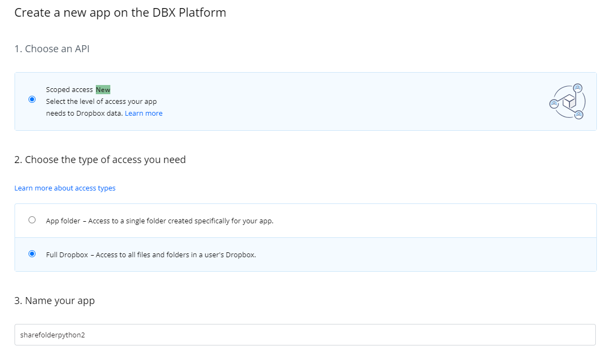
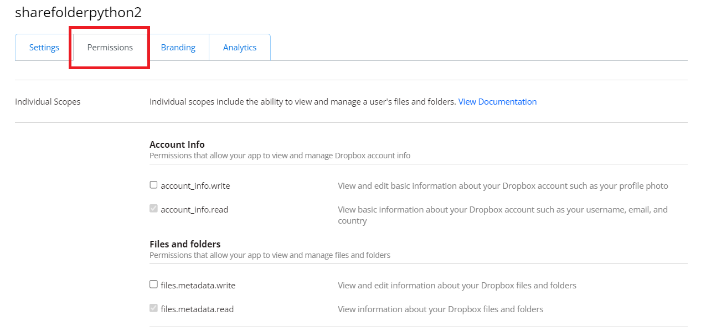
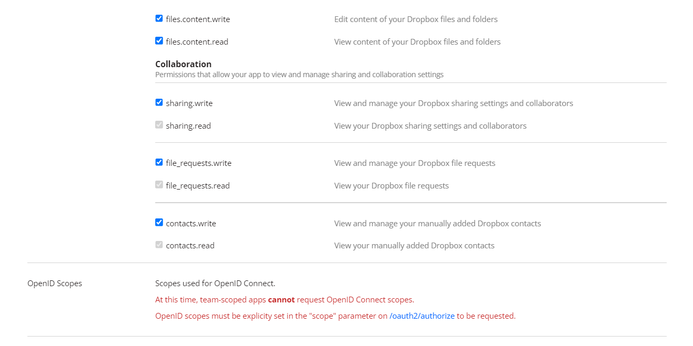
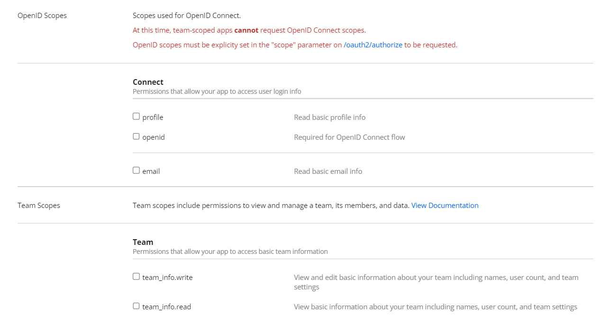
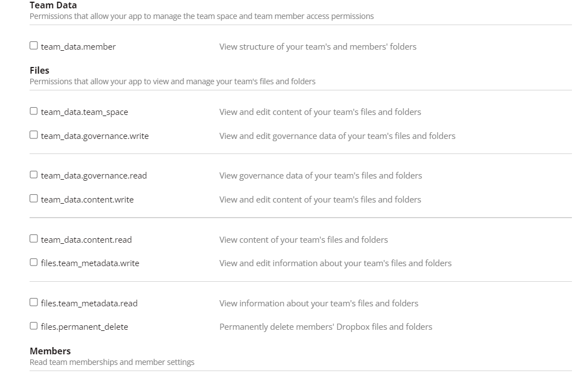
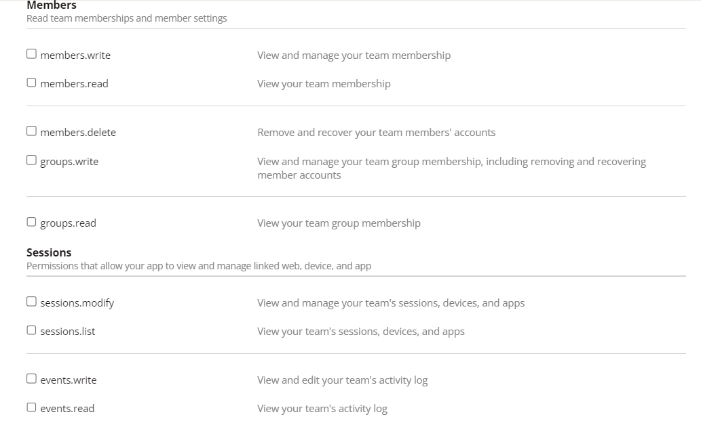
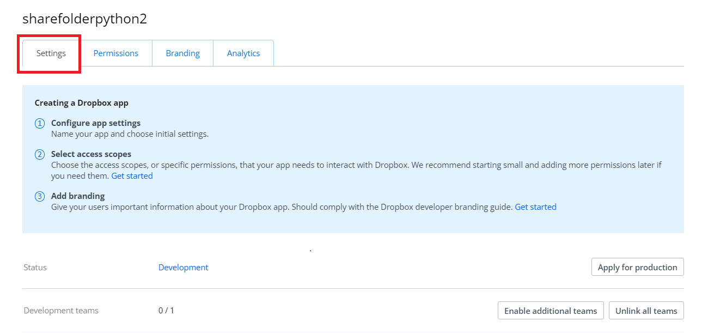
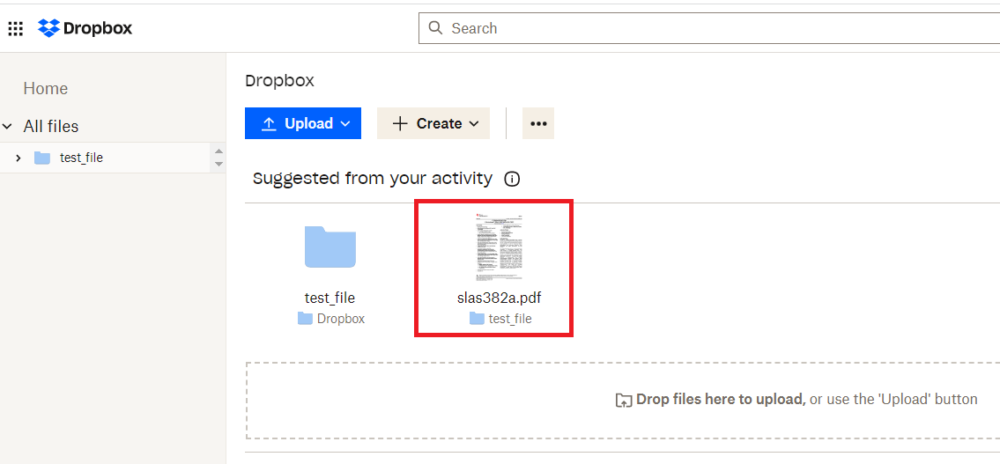
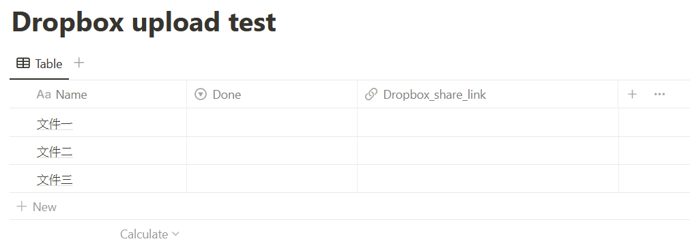
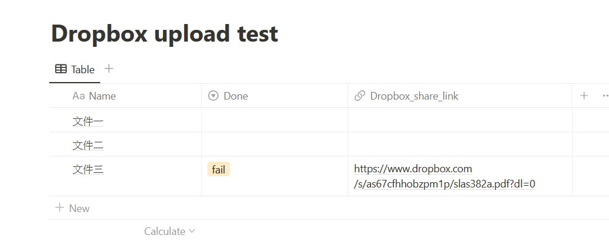

# Notion-Dropbox-Python
Python devs often face an issue with Notion: no file upload via Notion API. To overcome this, use Dropbox as a workaround. Upload files to Dropbox, share their links, manage them in Notion, and handle the entire workflow with Python.
# Python上傳檔案到Dropbox同步到Notion

Cover: image/pythonxnotionxdropbox.png
Created: April 11, 2023 9:44 PM
工具項目: Notion API, Python

# 動機

常用Python開發與Notion做對街，應該會常遇到一個問題是Notion目前無法透過Notion API做檔案上傳功能，因此這裡想透過Dropbox方式當作媒介，把檔案先上傳到Dropbox雲端裡，在做分享檔案連結，把連結上傳到Notion表格中做管理，因此就可以依然透過Python做所有作業流程

# Step 1 : 首先必須有Dropbox帳號且登入

登入後，請進入Dropbox API網址[https://www.dropbox.com/developers/apps](https://www.dropbox.com/developers/apps)，且註冊一個開發專案名稱，設定如下:



這裡使用專案名稱為 : sharefolderpython2

# Step 2 : 設定API功能權限

點選紅色框選單(Permissions)進入頁面











# Step 3 : 取得Dropbox Token值

切換到紅色框(Settings)頁面



獲得token (下圖紅色框) ****


# Step 4 : 簡單驗證python程式

接下來驗證程式碼是否可以正常上傳到Dropbox雲端中

請參考下面程式碼

```python
import dropbox
import os

def get_file_path(file_name):
    # 找出要上傳的檔案的目錄
    path = os.path.dirname(__file__)
    file_path = '{}/{}'.format(path, file_name)
    return file_path

def upload_file(access_token, upload_file, file_to):
    # 設定好dropbox
    dbx = dropbox.Dropbox(access_token)
    # 打開要上傳的檔案
    with open(upload_file, 'rb') as f:
        # 把檔案上傳，如果有同名檔案的話就overwrite他
        dbx.files_upload(f.read(), file_to, mode=dropbox.files.WriteMode.overwrite)
        print('done.')

def get_shared_link(access_token, file_to):
    # 設定好dropbox
    dbx = dropbox.Dropbox(access_token)
    # 獲得檔案分享連結
    shared_link = dbx.sharing_create_shared_link(file_to)
    print('獲得分享連結：', shared_link.url)
    return shared_link

if __name__ == '__main__':
    # 這裡填入剛剛在dropbox產生的token
    dropbox_token = 'sl.Bd4vQXXXXXXXXXXX...........'
    
    # 這裡可以指定你要上傳的資料名稱，我這裡假設是Test.pdf
    uploadfile = 'slas382a.pdf'
    
    # 取得要上傳的檔案路徑
    file_from = get_file_path(uploadfile)
    print('印出file_from:{}'.format(file_from))
    
    # 這裡是你要上傳到dropbox的指定路徑
    file_to = '/test_file/{file_name}'.format(file_name=uploadfile)
    print('印出要上傳的路徑{}'.format(file_to))
    
    # 上傳檔案
    upload_file(dropbox_token, file_from, file_to)
    
    # 獲得分享連結
    getlink = get_shared_link(dropbox_token, file_to)
```

最後您登入Dropbox雲端頁面確認是否有成功上傳

連結 : [https://www.dropbox.com/home](https://www.dropbox.com/home)

如下圖紅色框檔案，已經成功上傳到雲端



並且getlink也可以獲得分享連結， 如下:

[https://www.dropbox.com/s/as67cfhhobzpm1p/slas382a.pdf?dl=0](https://www.dropbox.com/s/as67cfhhobzpm1p/slas382a.pdf?dl=0)

# Step 5 : 創立Notion表單

如下圖是這次創立的表單，並且要設定Connection相關設定及權限，才有辦法透過python連接

詳細步驟可參考:[https://paulgiver.super.site/page-2](https://paulgiver.super.site/page-2)



# Step 6 : 上傳Dropbox連結到Notion表單內

透過以下程式碼可以成功把狀態與分享連結上傳到Notion表單內容中



範例代碼如下:

```python
import os
from notion_client import Client
from dotenv import load_dotenv

load_dotenv()  # 載入環境變數

# 建立 Notion Client 物件
notion = Client(auth="secret_E9fK5KgkK7xHubS.............")

# 設定 Notion Database ID
database_id = "be1c915648344489a23480691e0f1427"
              

def update_processing_states(state_name, url):
    # 取得資料庫中的所有資料
    results = notion.databases.query(database_id).get("results")
    page_id = results[0]["id"]

    # 更新 processing states 欄位中的狀態為 state_name
    notion.pages.update(
        **{
            "page_id": page_id,
            "properties": {
                "Done": {
                    "select": {
                        "name": state_name
                    }
                },
                "Dropbox_share_link": {
                    "url": url
                }
            }
        }
    )

    # 印出更新後的訊息
    print(f"Processing states 欄位已更新為 {state_name}")
    print(f"Attached file by AI 欄位已上傳為 {url}")

if __name__ == "__main__":
    # 設定Done欄位內的狀態
    state_name = "fail"
    url = "https://www.dropbox.com/s/as67cfhhobzpm1p/slas382a.pdf?dl=0"

    # 呼叫副程式更新 Notion 資料庫中的 processing states 欄位
    update_processing_states(state_name, url)
```
